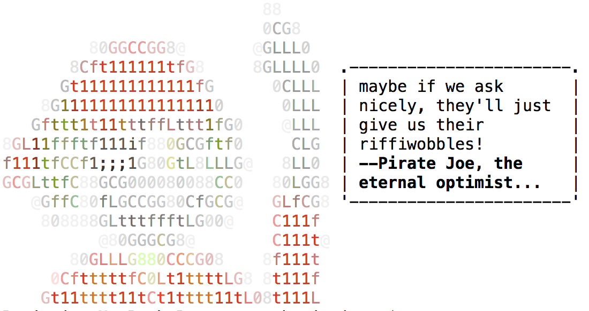

# Yarsay

> Hello Joe! tell Pirate Joe what to say.

Inspired by [yosay](https://github.com/yeoman/yosay), which was in turn inspired by [cowsay](https://en.wikipedia.org/wiki/Cowsay).

[](https://travis-ci.org/bcoe/yarsay)
[](https://coveralls.io/r/bcoe/yarsay?branch=)
[](https://www.npmjs.com/package/yarsay)



## Usage

```sh
yarsay "Hello World!"
```

Or,

```sh
echo "Hello World" | yarsay
```

Or,

```js
var yarsay = require('./lib/yarsay')
yarsay('Hello World!').say()
```

## License

ISC
